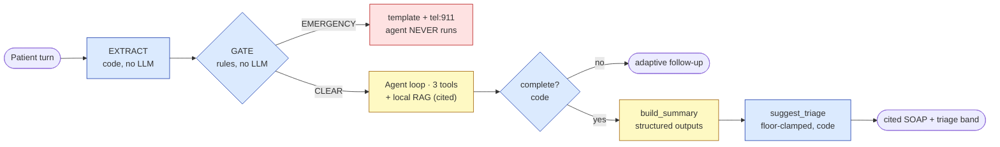

# ScribeIntake

**An agentic pre-visit clinical intake chat with a _deterministic_ safety gate.** It interviews a
patient, runs a code-based red-flag check on **every** turn, grounds health claims in **cited**
public-domain guidelines (production RAG), and produces a structured **SOAP summary + triage band**
for a clinician, wrapped in a **published eval harness** that proves it is reliable. It never
diagnoses or prescribes.

> **The honest claim, up front:** the deterministic safety rules miss **0** cases on the frozen
> must-escalate set (gated at 100% on every commit); end-to-end adversarial recall is reported
> **distributionally** across N runs; schema-valid SOAP is **100%**; judge-to-human agreement is
> **κ = 1.00**. The thing that matters is being able to say **exactly which part is deterministic
> and which is distributional**, never "100% recall, period." The honest version is the more
> impressive one.

> ⚠️ **Educational demo on synthetic data only. Not a diagnostic, triage, or crisis service.**
> No real PHI anywhere. Adult patients only; US-English (988/911). See
> [`docs/compliance.md`](docs/compliance.md).

---

## The problem & the thesis

Pre-visit intake is repetitive clinician work, and the catastrophic failure mode is a **missed red
flag**: a patient describing a heart attack or a stroke who gets queued as routine. The naive LLM
approach makes the safety check a *tool the model may choose to call*, which is exactly the wrong
place for a guarantee.

**ScribeIntake's thesis: the safety guarantee comes from _code_, not from the LLM.** Every turn is
run through a deterministic extractor and rule engine **before** the model is invoked. On an
emergency the agent **never runs**; the response is a templated escalation with `tel:911`. "0 missed
on the frozen must-escalate set" is a literal `assert` in CI, not "the model usually catches it."
That also makes it the strongest prompt-injection defense there is: **there is no instruction for an
injection to override.**

## Architecture

🟦 deterministic (code, gated) · 🟨 LLM (distributional, never gated) · 🟥 safety short-circuit.
Full diagrams, the in-process wiring, and the two-tier CI are in [`docs/architecture.md`](docs/architecture.md).



## Leaderboard (real numbers; full page: [`docs/leaderboard.md`](docs/leaderboard.md))

Two groups, two epistemics. Group 1 is gated in code on every commit and breaks the build on any
regression. Group 2 needs a key and is **tracked, never gated**.

**DETERMINISTIC · GATED** (per-commit, no API key. Source: [`eval/leaderboard.json`](eval/leaderboard.json), regen `make eval-ci`)

| Metric | Value |
|---|---|
| Rule correctness | **100%** |
| Frozen must-escalate | **0 miss** |
| Triage floor never violated | **100%** |
| Schema validity | **100%** |

**DISTRIBUTIONAL · TRACKED** (recorded live run 2026-06-20, `gpt-5.5`, N≥2. Regen `make eval`)

| Metric | Value | | Metric | Value |
|---|---|---|---|---|
| E2E recall | **1.00 ± .00** | | Judge↔human κ (overall) | **1.00** |
| False-alarm | **0.00** | | Context precision / recall | **0.98 / 1.00** |
| SOAP field acc | *pending* † | | RAGAS faithfulness | **0.98** |
| Triage band acc | *pending* † | | Answer relevancy | **0.75** |

> † **Honest pending, not a bug.** With the current agent slot vocabulary, naturally driven routine
> runs don't reach `completed` within the scenario turn budget, so these cells stay pending on a
> full live run. The harness reports a pending cell, never a fabricated band. A planned
> agent-prompt fix populates them with no harness change. The summary *render* path is proven
> against a seeded completed session ([app browser smoke](app/tests/smoke_browser.py), 17/17). The
> committed key-free `leaderboard.json` shows these as `pending` by design (it can't carry a
> key-gated number). See [`docs/leaderboard.md`](docs/leaderboard.md) for every number's source.

## Quickstart

Verified copy-paste-true on Windows (PowerShell / `tasks.ps1`) and POSIX (`make`). The deterministic
parts need **no API key**.

**Fastest path: Docker** (recommended for testing; citations work out of the box):

```bash
docker compose up --build      # builds the RAG index + warms the local models into the image
# open http://localhost:8000   (full UI + API; live turns use the .env LLM key, the gate is key-free)
```

The container builds the guideline index at image-build time and bundles the local embedder and
reranker, so **cited SOAP observations work offline**, with no torch setup on the host. See
[`DEPLOY.md`](DEPLOY.md) for details. Native (non-Docker) setup below:

```powershell
# 1. Install the engine + dev tools (no key needed)
make install                  # POSIX  ·  Windows:  pip install -e "./core[dev]"

# 2. The headline proof: deterministic tier, free, ~10s
python -m pytest -m "not live"          # → 637 passed
python -m eval.run --deterministic-only # → the 4 gated metrics all 100% / 0-miss

# 3. Run the full app (engine + API + UI), same-origin, one command
make install-api              # adds FastAPI + uvicorn (api/ is import-only)
copy ..\.env .env             # GPT-5.5 key + endpoint (gitignored; see "Models" below)
make run-api                  # POSIX  ·  Windows:  .\tasks.ps1 run-api  ·  or  make demo
# open http://localhost:8000   (the deterministic gate runs in core, upstream, regardless)

# 4. (Optional) the full distributional eval + cost report (needs the key)
make eval                     # ×3 distributional run → eval/leaderboard.{json,md}
make cost-report              # → observability/cost_report.{json,md} + dashboard.html
```

> **Live retrieval (optional):** `make install-rag` adds the local `bge` embedder + reranker
> (torch), and `make ingest` builds the guideline index. The deterministic tests use a keyless
> hashing-embedder fallback, so they run without it.

## How it works

- **Per-turn pipeline:** extract → gate → [emergency short-circuit] OR agent loop → completion
  check → `build_summary` (Opus, **native structured outputs**, so the SOAP is schema-valid) →
  `suggest_triage` (floor-clamped). One code path, in [`core/.../orchestrator.py`](core/src/scribeintake/orchestrator.py).
- **In-process orchestrator:** `eval/`, `observability/`, and `api/` all import `core` directly,
  with **no service-to-service HTTP** between Python components. The engine is stateless per turn
  (load → run → save SQLite), which makes eval runs isolated and parallel-safe. The browser UI is
  the one component over HTTP/SSE, through a **thin** `api/` adapter (no engine logic, enforced by a
  grep test).
- **RAG citation binding:** retrieval is BM25 + local `bge` embeddings + local `bge` reranker, all
  on-box. Health claims cite a retrieved guideline chunk; empty retrieval is flagged `uncited`,
  never invented.
- **Safety invariants** (never regress): the extractor has no LLM; the gate is code upstream of the
  LLM; emergency short-circuits the agent; escalation is monotonic; the safety path fails safe; the
  triage band is never below the floor.

## Evaluation: why the numbers are trustworthy

The eval harness ([`eval/`](eval/README.md)) drives the whole app **in-process**, ×N per scenario,
with isolated SQLite per run. Trust comes from the structure, not the size of a number:

- **Two physically separate code paths.** Deterministic metrics are computed once and **gated at
  100%**; distributional metrics are **mean ± spread over N rounds**. It is structurally impossible
  to gate a commit on an LLM number.
- **Frozen must-escalate subset**, never tuned, with an `assert` of 0 misses.
- **Judge calibration.** The LLM judge is meta-evaluated against 15 hand-labelled both-class cases:
  **Cohen's κ = 1.00** (0 judge-to-human disagreements). "Fix the rubric, not the labels."
- **Held-out RAGAS retrieval evals**, a transparent local implementation, every number unit-testable.
- **Two-tier CI:** a per-commit deterministic gate (free, no key) plus a nightly distributional run
  (key-gated, reports drops, never hard-fails on wobble). See [`.github/workflows/ci.yml`](.github/workflows/ci.yml).

## Cost & latency (cache-aware; see [`observability/`](observability/README.md))

Cost is computed from the three input buckets; the no-cache baseline is an exact **counterfactual
reprice**. Committed synthetic demo: **$0.0117/session, 38% saved by caching**, intake p50 1700 /
p95 2100 ms (within the p50<3s / p95<6s targets). Recorded live session: $0.0429, intake p50 2290 /
p95 4715 ms, prompt cache verified live (`cache_read` 0 → 1280 tok warm). Local RAG tool cost is
**$0.00**. Regen: `make cost-report`.

## Security & compliance ([`docs/compliance.md`](docs/compliance.md))

**Synthetic data only; no real PHI.** Everything that touches patient text (extractor, embeddings,
reranker, BM25, storage) runs **locally**; the **only** outbound component is the LLM. That makes
the system a **drop-in for a HIPAA boundary** by pointing the model client at a **BAA-covered
endpoint** (Bedrock / Vertex / platform deployment). Audit logging (`tool_calls`, `safety_events`),
refusal handling, and not-a-diagnosis disclaimers in every summary payload.

## Release & acceptance

`make acceptance-ci` (no key) runs one repeatable release gate: the deterministic suite, the
deterministic eval tier, the **six-invariant guard** ([`core/tests/test_invariants_integration.py`](core/tests/test_invariants_integration.py)),
the security/deps audit ([`scripts/audit.py`](scripts/audit.py)), a key-free safety e2e, perf vs the
latency targets, and a docs-claims check. It prints a **sign-off matrix** to
[`acceptance_report.md`](acceptance_report.md). `make acceptance` (key in `.env`) adds the live model
row plus measured latency. Deploy and the HIPAA BAA-boundary posture are in [`DEPLOY.md`](DEPLOY.md);
the human checklist is in [`docs/release-checklist.md`](docs/release-checklist.md); the version
history is in [`CHANGELOG.md`](CHANGELOG.md).

## Demo

`make demo` (or `.\tasks.ps1 demo`), then open `http://localhost:8000`. The 2-minute, 5-beat
storyboard with exact phrases and a Loom checklist is in [`docs/demo-script.md`](docs/demo-script.md).
The repeatable demo *is* the browser smoke ([`app/tests/smoke_browser.py`](app/tests/smoke_browser.py),
17/17): emergency / crisis / injection sheets (key-free), seeded cited SOAP, Proof tab.

## Models

Pinned: intake loop `claude-sonnet-4-6`; summary/triage/judge `claude-opus-4-8`. The wired demo
deployment is **Azure GPT-5.5** (a single reasoning model for both roles). The client seam is
provider-agnostic, so pointing it back at Claude on a BAA-covered endpoint is a config change.
Credentials live in `.env` only (gitignored, never committed). The Anthropic API has **no `seed`**
and rejects `temperature` on Opus, so reproducibility lives in **code** (rules, schema, triage
floors), and LLM metrics are reported with spread, never claimed "seeded/low-temp."

## Repo map

```text
core/           the engine: framework-free package (orchestrator, safety, intake, rag, tools)
api/            thin FastAPI adapter (HTTP/SSE): reshape only, no engine logic
eval/           eval harness (in-process, ×N), gold scenarios, metrics, judge, RAGAS, leaderboard
observability/  read-only cost/latency/cache analysis + dashboard
app/            the browser UI (ScribeIntake.dc.html): renders only; safety comes from the API
scripts/        release tooling: acceptance run (sign-off matrix) + security/deps audit
docs/           architecture · leaderboard · demo script · compliance · release checklist
.github/        two-tier CI (per-commit deterministic gate + audit + nightly distributional)
```

## What's next

Built later on this same spine: a **voice intake/triage** agent (speech-to-speech); domain skins
(diabetes / hypertension / meds); returning-patient memory plus a clinician-feedback loop that grows
the eval set. Nearer-term hardening: aligning the agent's slot vocabulary so a naturally driven
routine intake reaches `completed` end-to-end (which populates the SOAP-field and triage-band cells).

## License

See [`LICENSE`](LICENSE). Public-domain guideline sources are listed in
[`core/.../kb/sources.csv`](core/src/scribeintake/kb/).
