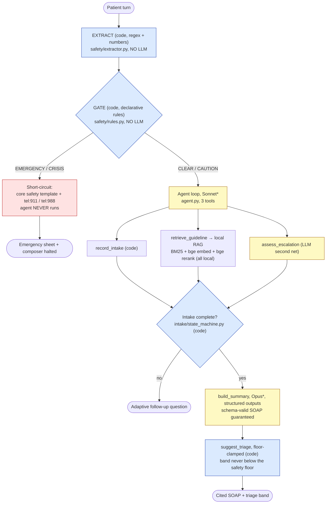
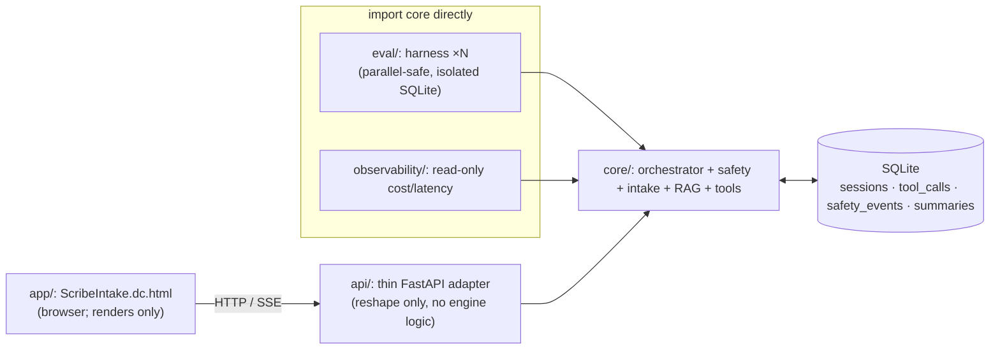
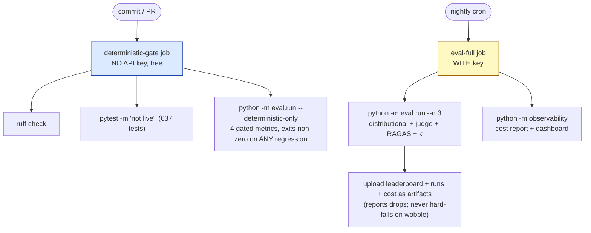

# ScribeIntake architecture

> The one thing to take away: **the safety guarantee comes from code, not from the model
> choosing to call a tool.** Every patient turn is run through a deterministic extractor and rule
> engine **before** the LLM is ever invoked. "0 missed on the frozen must-escalate set" is a
> literal `assert` in the test suite, not "the model usually catches it."

---

## Per-turn pipeline

Each patient message flows through one code path: the in-process orchestrator
([`core/.../orchestrator.py`](../core/src/scribeintake/orchestrator.py)). The **EXTRACT** and
**GATE** boxes contain **no LLM call**; everything downstream of the gate is the agent.

**Legend:** 🟦 blue = **deterministic (code)**, gated at 100%; 🟨 yellow = **LLM** (reported
distributionally, never gated); 🟥 red = the safety short-circuit.

\* **Model pins:** the intake loop targets `claude-sonnet-4-6`, summary/triage/judge target
`claude-opus-4-8`. The wired demo deployment is **Azure GPT-5.5** (a single reasoning model for both
roles). The seam is model-agnostic, so pointing it back at Claude is a config change.

### The seven steps

1. **Extract.** `safety/extractor.py` turns the raw turn into a typed `Signals` object using regex
   and numeric parsing. No model, no network. Deterministic and unit-frozen.
2. **Gate.** `safety/rules.py` evaluates the declarative red-flag rule set against those signals. It
   emits `CLEAR / CAUTION / CRISIS / EMERGENCY`.
3. **Short-circuit.** On EMERGENCY/CRISIS the agent **never runs**; the response is a core safety
   template (verbatim wording, `tel:911` / `tel:988`) and the escalation floor is pinned.
4. **Agent loop.** Otherwise the Sonnet/GPT loop runs with three tools (`record_intake`,
   `retrieve_guideline`, `assess_escalation`). `assess_escalation` is a **second, independent** net
   for oblique danger: it can raise the floor but can never lower the code gate.
5. **Completion check.** `intake/state_machine.py` (code) decides when the required canonical slots
   are filled; until then the agent asks the next adaptive follow-up.
6. **Summary.** `build_summary` is a terminal Opus call using **native structured outputs**, so the
   SOAP is schema-valid by construction (not validated after the fact).
7. **Triage.** `suggest_triage` clamps the predicted band to **never fall below** the safety floor
   set in steps 2 to 4 (monotonic per session).

---

## In-process wiring

The orchestrator is a plain importable module. **Everything imports it directly. There is no
service-to-service HTTP between Python components.**

- `eval/` and `observability/` **import `core` in-process**. That is what makes eval runs isolated
  and parallel-safe (fresh SQLite per run; the orchestrator is **stateless per turn**: load state →
  run → save).
- The **browser** frontend can't import a Python module, so it is the one component that talks over
  **HTTP/SSE**, through `api/`, a *thin adapter* that only reshapes what the orchestrator already
  produced (the "no safety/model logic in `api/`" rule is a passing grep test). The load-bearing
  principle (no HTTP where it matters, so evals stay parallel-safe) is preserved.

---

## Two-tier CI

The headline honesty mechanism: it is **structurally impossible to gate a commit on an LLM
number.**

- **Per-commit (free, deterministic):** lint, the deterministic test tier, and the four gated eval
  metrics (rule correctness, frozen must-escalate, triage-floor-never-violated, schema validity).
  Breaks the build on any regression.
- **Nightly (key-gated, distributional):** the full ×N eval, the LLM judge, RAGAS retrieval evals,
  and the cost/observability report. **Reported, never asserted.** A one-point sampling wobble must
  not break the build; only the still-gated deterministic metrics are build-breaking.

See [`.github/workflows/ci.yml`](../.github/workflows/ci.yml).

---

## Safety invariants (hold after every change, never regress)

1. `safety/extractor.py` contains **no LLM call**.
2. The gate runs in **code, upstream of the LLM**, so patient text can never disable it (the
   strongest prompt-injection defense: there is no instruction to override).
3. On a gate EMERGENCY the agent **never runs** (short-circuit), asserted.
4. Escalation is **monotonic per session**: a floor, once set, never lowers.
5. Any exception in the safety path **fails safe** (escalates to in-person care), never silently
   continuing as CLEAR.
6. The predicted triage band is **never below** the safety floor.
